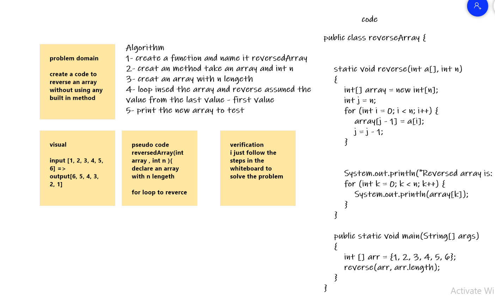

# Reverse an Array

we write an function called reverse array without using any built in method to reverse an array

## Whiteboard Process

## Approach & Efficiency

 i divided the problem to a small problem then solve it part by part