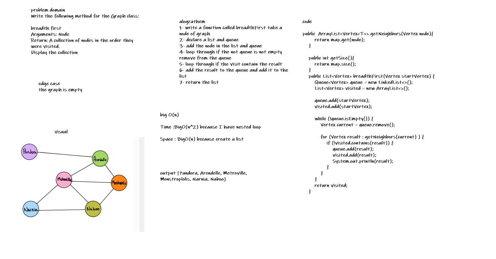
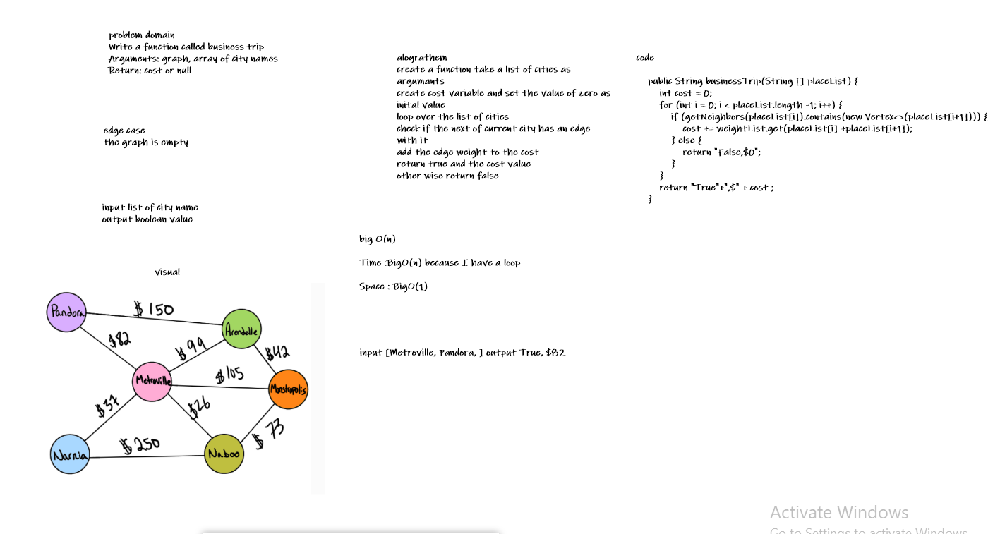

# Graphs
A graph is a non- linear data structure that can be looked at as a collection of vertices (or nodes) potentially connected by line segments named edges.
## Challenge
Implement your own Graph. The graph should be represented as an adjacency list, and should include the following methods:

add node

add edge

get nodes

get neighbors

size

## Approach & Efficiency
add node : time = O(1) because we didn't use loops, space = O(n) because we declared a new ArrayList.

add edge : time = O(1) because we didn't use loops, space = O(1) because we didn't declare any arrays.

get nodes : time = O(n) because we use loop , space = O(n) because we declared a HashSet.

get neighbors : O(1) for both time and space complexity because there is no loops or arrays.

size : O(1) for both time and space complexity.

## API
add node : this method is to add a new node to the graph.

add edge : this method is to add a new edge between two Nodes in the graph.

get nodes : this method returns a HashSet which contains all the Nodes in the graph.

get neighbors : this method return a list of all the Nodes that are connected to the Node we pass.

size : this method returns the size of the graph HashSet.

# Challenge Summary
<!-- Description of the challenge -->
problem domain
Write the following method for the Graph class:

breadth first
Arguments: Node
Return: A collection of nodes in the order they were visited.
Display the collection

## Whiteboard Process
<!-- Embedded whiteboard image -->

## Approach & Efficiency
<!-- What approach did you take? Why? What is the Big O space/time for this approach? -->
big O(n)

Time :BigO(n^2) because I have nested loop

Space : BigO(n) because create a list

# Challenge Summary
<!-- Description of the challenge -->
problem domain
Write a function called business trip
Arguments: graph, array of city names
Return: cost or null

## Whiteboard Process
<!-- Embedded whiteboard image -->

## Approach & Efficiency
<!-- What approach did you take? Why? What is the Big O space/time for this approach? -->
big O(n)

Time :BigO(n) because I have a loop

Space : BigO(1) 

