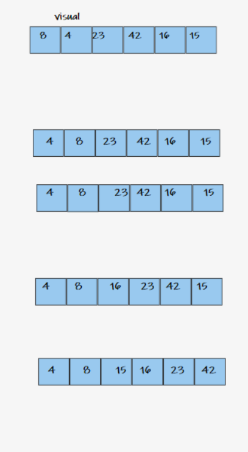
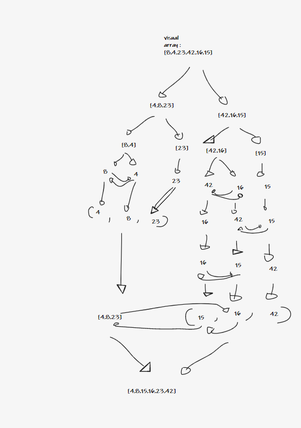
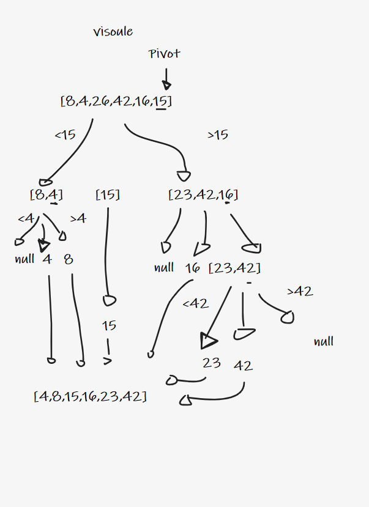

# Insertion Sort

Insertion sort is a simple sorting algorithm that builds the final sorted array one item at a time.

## Pseudocode

InsertionSort(int[] arr)

    FOR i = 1 to arr.length

      int j <-- i - 1
      int temp <-- arr[i]

      WHILE j >= 0 AND temp < arr[j]
        arr[j + 1] <-- arr[j]
        j <-- j - 1

      arr[j + 1] <-- temp

## Trace

Array: [8,4,23,42,16,15]

Pass 1:
 we will find if there is a smaller number in the array than the current number at index[0], and find this smaller number at index [1]; so the smaller number will be swipped with index[0].

Pass 2:
in the second pass, we will find if there is a smaller number than the current index[1], and since there is no smaller it will swipped itself and the array will stay the same.

Pass 3:
now we will find the minimum number after the current index[2] which is at index[5], so it will be swipped with index[2].

Pass 4:
now we will find the minimum number after the current index[3] which is at index[4], so it will be swipped with index[3].

Pass 5:
now we will find the minimum number after the current index[4] which is at index[5], so it will be swipped with index[4].

pass 6 :
now this is the last index so it is the largest number, so it will be swipped with inself and there will be no new changes.

## Efficency

if we provide an already sorted array to the insertion sort algorithm, it will still execute the outer for loop, thereby requiring n steps to sort an already sorted array of n elements, which makes its best case time complexity a linear function of n.

Wherein for an unsorted array, it takes for an element to compare with all the other elements which mean every n element compared with all other n elements. Thus, making it for n x n, i.e., n2 comparisons.

Insertion sort uses no extra space.Therefore , it has space complexity of O(1).

Time: O(n^2)
Space: O(1)
# Merge Sort

Sorting an array by dividing it to two half each time until it is sorted from the smallest to the largest number and then merge it.

## Pseudocode

ALGORITHM Mergesort(arr)
DECLARE n <-- arr.length

    if n > 1
      DECLARE mid <-- n/2
      DECLARE left <-- arr[0...mid]
      DECLARE right <-- arr[mid...n]
      // sort the left side
      Mergesort(left)
      // sort the right side
      Mergesort(right)
      // merge the sorted left and right sides together
      Merge(left, right, arr)
      ALGORITHM Merge(left, right, arr)
      DECLARE i <-- 0
      DECLARE j <-- 0
      DECLARE k <-- 0

    while i < left.length && j < right.length
        if left[i] <= right[j]
            arr[k] <-- left[i]
            i <-- i + 1
        else
            arr[k] <-- right[j]
            j <-- j + 1

        k <-- k + 1

    if i = left.length
       set remaining entries in arr to remaining values in right
    else
       set remaining entries in arr to remaining values in left

## Trace
Array: [8,4,23,42,16,15]

Pass1:
in the first pass, the array will be split to two half.

Pass 2
the two half will be split again, so we have 4 arrays.

Pass 3
the arrays which have more than one element will be split again, so we have 6 arrays.

Pass 4
The left side will be sorted.

Pass 5
The right side will be sorted

Pass 6
after the sorting finish, the arrays will be merged into one array.

Pass 7
Final iteration will be the finished merged array.

## Efficency

This is a divide-and-conquer algorithm, so it takes O(n log n) time—that’s n steps to merge arrays, log n times.
Since at any given time, it only ever needs n elements stored in arrays to merge, it uses O(n) space.

big o :

 time :  O(n log(n)) 
 
 space: O(n)

# Quick Sort

take an array then divid it .

quick sort its take one elemant and make it a pivot element then move all less elemnt to the left and all the highest elemat to the right and repit it until the array sorted

## Pseudocode

ALGORITHM QuickSort(arr, left, right)
    if left < right
        // Partition the array by setting the position of the pivot value
        DEFINE position <-- Partition(arr, left, right)
        // Sort the left
        QuickSort(arr, left, position - 1)
        // Sort the right
        QuickSort(arr, position + 1, right)

ALGORITHM Partition(arr, left, right)
    // set a pivot value as a point of reference
    DEFINE pivot <-- arr[right]
    // create a variable to track the largest index of numbers lower than the defined pivot
    DEFINE low <-- left - 1
    for i <- left to right do
        if arr[i] <= pivot
            low++
            Swap(arr, i, low)

     // place the value of the pivot location in the middle.
     // all numbers smaller than the pivot are on the left, larger on the right.
     Swap(arr, right, low + 1)
    // return the pivot index point
     return low + 1

ALGORITHM Swap(arr, i, low)
    DEFINE temp;
    temp <-- arr[i]
    arr[i] <-- arr[low]
    arr[low] <-- temp

## Trace
Array: [8,4,23,42,16,15]

Pass 1 :
take on element and make it as a pivot element 

pass 2 : 
divid the array into half and sort it for two groups less then pivot and highse then pivot 

pass 3 : 
do the same thing for the divided arrays 

pass 4 : 

repit it until i have a sorted array

## Efficency

This is a divide-and-conquer algorithm, so, best case, it takes O(n log n) time—that’s n steps to partition the array, log n times.
Since at any step in the process, it only swaps elements within the array, it uses O(1) space.

time : O(n log n)

space : O(1)