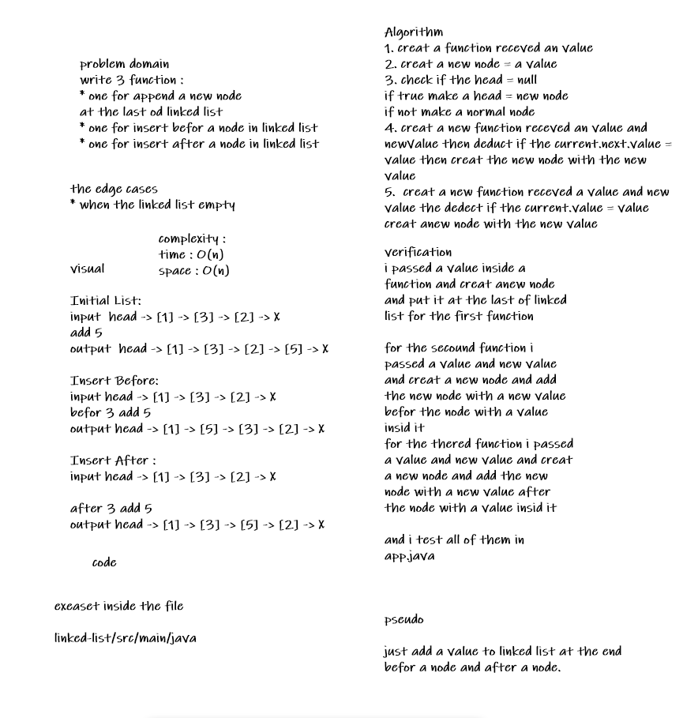
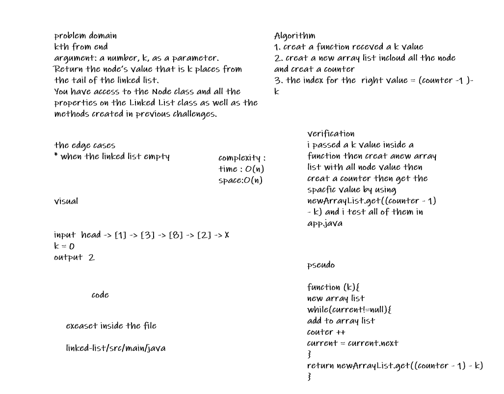
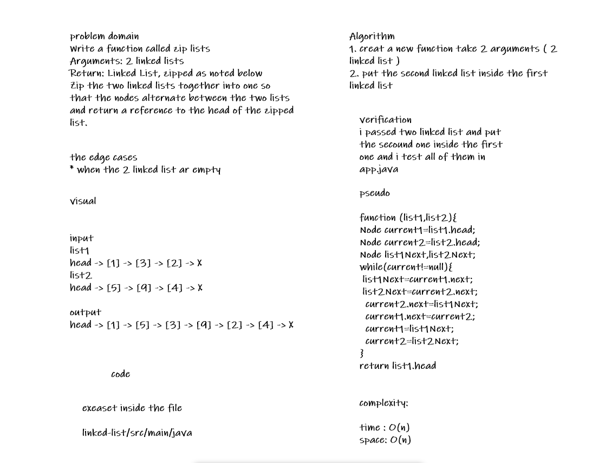

# Challenge Summary CC6
<!-- Description of the challenge -->

write 3 function :
* one for append a new node
  at the last od linked list
* one for insert before a node in linked list
* one for insert after a node in linked list

## Whiteboard Process
<!-- Embedded whiteboard image -->

## Approach & Efficiency
<!-- What approach did you take? Why? What is the Big O space/time for this approach? -->
time & space : O(n)

## Solution
<!-- Show how to run your code, and examples of it in action -->
append
{1}->{3}->{2}->{5}->{4}->NULL
===================================

insert Before
{1}->{7}->{3}->{2}->{5}->{4}->NULL
===================================

insert After
===================================

{1}->{7}->{3}->{2}->{5}->{45}->{4}->NULL
===================================

# Challenge Summary CC7
<!-- Description of the challenge -->

kth from end
argument: a number, k, as a parameter.
Return the node’s value that is k places from the tail of the linked list.
You have access to the Node class and all the properties on the Linked List class as
well as the methods created in previous challenges.

## Whiteboard Process
<!-- Embedded whiteboard image -->

## Approach & Efficiency
<!-- What approach did you take? Why? What is the Big O space/time for this approach? -->
time & space : O(n)

## Solution
<!-- Show how to run your code, and examples of it in action -->

kth function

Linked list = [1, 2, 3, 4]

index = ( 3 )

value = ( 1 )

# Challenge Summary CC8
<!-- Description of the challenge -->
Write a function called zip lists
Arguments: 2 linked lists
Return: Linked List, zipped as noted below
Zip the two linked lists together into one so that the nodes alternate between the two lists and
return a reference to the head of the zipped list.

## Whiteboard Process
<!-- Embedded whiteboard image -->

## Approach & Efficiency
<!-- What approach did you take? Why? What is the Big O space/time for this approach? -->
time & space : O(n)

## Solution
<!-- Show how to run your code, and examples of it in action -->

First list

{1}->{3}->{2}->NULL
===================================

second list

{5}->{9}->{4}->NULL
===================================

zipList

{1}->{5}->{3}->{9}->{2}->{4}->NULL
===================================